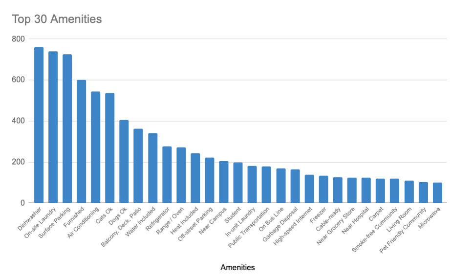

# Abodo.com Apartment Scraper - University of Michigan, Ann Arbor

This is the first part of the Conversational AI Project, which involves the task of scraping apartments information from Abodo.com (University of Michigan, Ann Arbor area) and building a Excel file before proceeding to building a database.

Here're some brief overview/analysis on the top 50 common amenities in Ann Arbor apartments.

